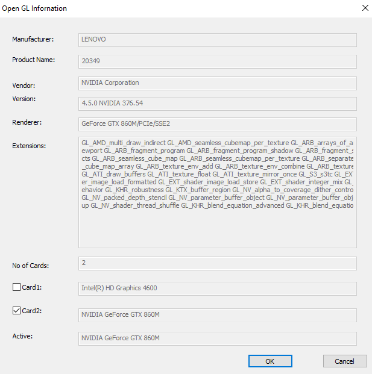

Introduction
============

Recently, I was working with graphic software that was running slower than it
was curious that I could not find which GPU it was using on my XPS 15 2in1 and
wrote some C++ software that detects which GPU it uses while rendering on screen
when using Open GL and also reported which GPU’s on the system. Users can use
this and support personally, to help showed performance issues.

Unfortunate I could not find a clean way to change programmatically a GPU to a
different GPU for OpenGL operation. This will require more research and likely
be system dependent and hopefully in future Open GL API’s will be implemented.

Detecting current active Open GL GPU
====================================

We can do this using Open GL function glGetString with GL_VENDER and GL_RENDERER
parameters. Primary the GL_RENDERER is use GL_VENDER can be help later to match
the vender with what is in the register for GPU’s on the system.

Detecting available GPUs in System
==================================

Using Windows registry, we can find Current GPU in the following location

KEY_LOCAL_MACHINE\\SYSTEM\\CurrentControlSet\\Control\\Video\\

And in the following location

{GUID}\\Video

With Key as DeviceDesc

With example as \@oem22.inf,%ikblhalogt2%;Intel(R) HD Graphics 630

With characters after; as string of GPU name

Screenshots
===========

**DELL XPS 15 2in1**

This Laptop has the Hybrid i7-8705g with Quad Core Intel i7 and changed AMD
Radeon RX Vega M GL Discrete GPU. By default, Laptop uses Intel integrated GPU
for lower power for most operations but has control software to show to use
discrete GPU.

**Lenova Y-50**

This is older gaming Laptop with Intel Quad Core Intel i7-4700HQ and separate
Nvidia GeForce GTX 860M Discrete GPU. In my system, the default on the Nvidia.

Dell XPS 13 2in1 with 7Gen i7-7500U with only an integrated GPU

